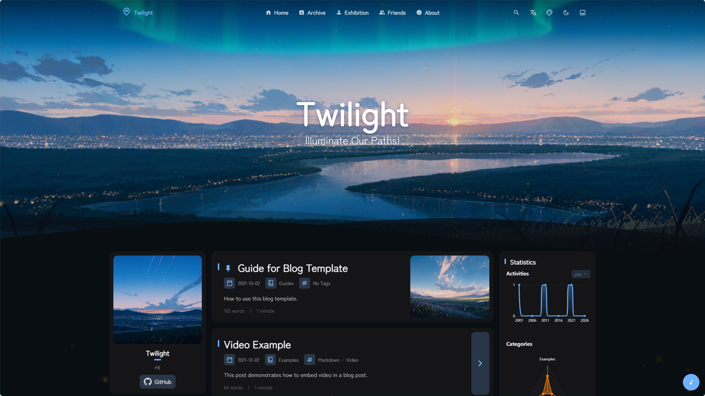
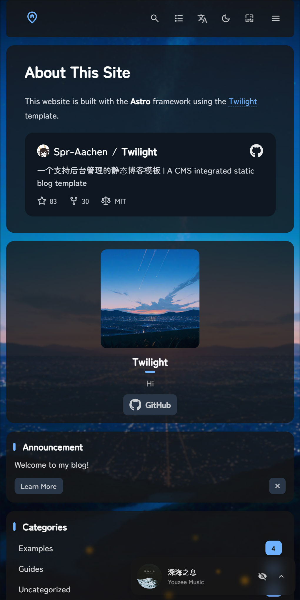
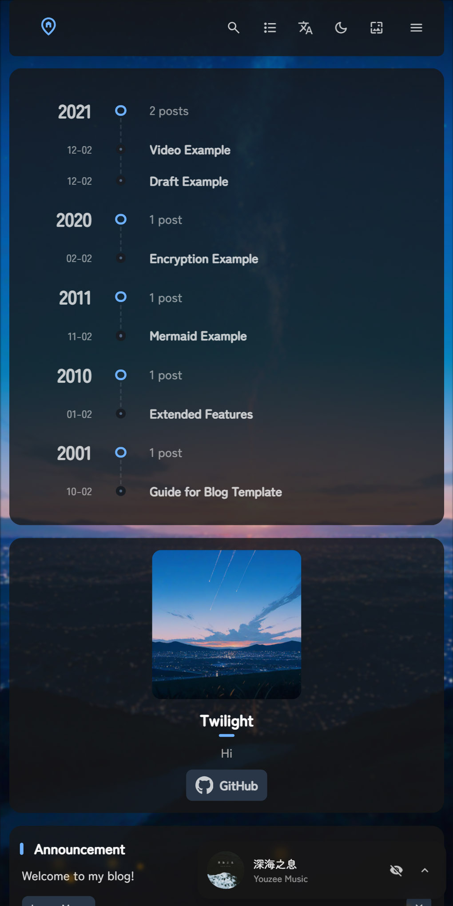

<div align = "center">

# swrited_blog

swrited 的个人博客源码仓库，基于 Twilight / Astro。

线上地址：

- <https://blog.swrited.top>
- Cloudflare Pages 预览域名：<https://swrited-blog.pages.dev>

</div>

## 维护说明

### 当前仓库分工

- `swrited/swrited_blog`：源码仓库，保存 Astro 源码、文章、配置。
- `swrited/swrited.github.io`：旧 GitHub Pages 发布仓库，只作为历史保留。

现在正式部署走 Cloudflare Pages，不再走 GitHub Pages。不要再用 `./deploy.sh` 发布站点，避免重新遇到 GitHub Pages / Fastly 的旧 HTML 缓存问题。

### 日常更新流程

修改文章或代码后，在本仓库提交并推送即可：

```bash
git add .
git commit -m "更新说明"
git push origin main
```

Cloudflare Pages 会自动拉取 `swrited_blog` 的 `main` 分支，执行构建并发布。

### Cloudflare Pages 配置

- 项目：`swrited-blog`
- 生产分支：`main`
- 构建命令：`pnpm run build`
- 构建输出目录：`dist`
- 自定义域名：`blog.swrited.top`

### 本地开发

```bash
pnpm install
pnpm dev
```

本地构建检查：

```bash
pnpm build
```

### 缓存说明

之前使用 GitHub Pages 时，HTML 会被 GitHub Pages 前面的 Fastly 缓存，并可能在部署后继续返回旧 HTML。旧 HTML 会引用已经删除的 `/_astro/*.hash.js` 或 CSS，导致 404。

迁到 Cloudflare Pages 后，部署更新由 Cloudflare 控制，发布速度和缓存可控性更好。若线上异常，可在 Cloudflare 后台的 Pages 项目里查看部署日志，或在 `swrited.top` 的缓存页面执行清缓存。

---

<div align = "center">

# Twilight

A CMS integrated static blog template built with Astro framework.

[**🖥️ Live Demo**](https://twilight.spr-aachen.com)
[**📝 Documentation**](https://docs.twilight.spr-aachen.com/en)

[](https://space.bilibili.com/359461611/lists/6641229)&nbsp;
[](https://youtube.com/playlist?list=PLzjq8Hx1SRV7yqZQiACcCJmKPeg5D8JKe&si=Bcz2o0PF8MFvx8ec)

<table style="width: 100%; table-layout: fixed;">
   <tr>
      <td colspan="5"></td>
   </tr>
   <tr>
      <td></td>
      <td></td>
      <td></td>
      <td></td>
      <td></td>
   </tr>
</table>

</div>

---

<div align = "center">

English | [**中文**](docs/README_ZH.md)

</div>


## ✨ Features

### Content
- **CMS Functionality**: Easy content management with headless CMS integration
- **Data Visualization**: Visualized personal data like projects, skills etc.
- **Automatic Navigation**: Automatic generation of post navigation

### Components
- **Analytics Support**: Umami analytics integration for visitor insights
- **Comment System**: Twikoo-powered comment functionality
- **Music Player**: Background music support with playlist management
- **PIO Widget**: Interactive live2d character support

### VFX
- **Smooth Transition Animations**: Polished page component transition animations
- **Customizable Theme Colors**: Realtime customizable color schemes
- **Dynamic Wallpaper System**: Carousel support with multiple display modes
- **Immersive Particle Effects**: Highly customizable animated particles

### Compability
- **Modern & Responsive Design**: Fully optimized for desktop and mobile devices
- **Multilingual Capability**: Built-in translation functionality for global accessibility


## 💻 Configuration

1. **Clone the repository:**
   ```bash
   git clone https://github.com/Spr-Aachen/Twilight.git
   # Navigate to the project directory
   cd Twilight
   ```

2. **Install dependencies:**
   ```bash
   # Install pnpm if not already installed
   npm install -g pnpm
   # Install project dependencies
   pnpm install
   ```

3. **Configure your blog:**
   - [Customize blog settings](https://docs.twilight.spr-aachen.com/en/config/core) inside `twilight.config.yaml`
   - [Manage site content](https://docs.twilight.spr-aachen.com/en/config/content) inside `src/content`

4. **Start the development server:**
   ```bash
   pnpm dev
   ```


## 🚀 Deployment

Deploy your blog to any static hosting platform


## ⚡ Commands

| Command                     | Action                        |
|:----------------------------|:------------------------------|
| ~~`pnpm lint`~~             | ~~Check and fix code issues~~ |
| ~~`pnpm format`~~           | ~~Format code with Biome~~    |
| `pnpm check`                | Run Astro error checking      |
| `pnpm dev`                  | Start local dev server        |
| `pnpm build`                | Build site to `./dist/`       |
| `pnpm preview`              | Preview build locally         |
| `pnpm astro ...`            | Run Astro CLI commands        |
| `pnpm new-post <filename>`  | Create a new blog post        |


## 🙏 Acknowledgements

- Prototype   - [Fuwari](https://github.com/saicaca/fuwari)
- Inspiration - [Yukina](https://github.com/WhitePaper233/yukina) & [Mizuki](https://github.com/matsuzaka-yuki/Mizuki)
- Translation - [translate](https://gitee.com/mail_osc/translate)
